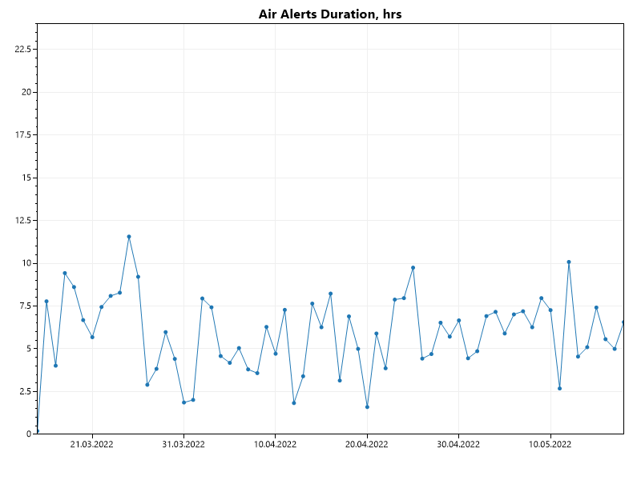
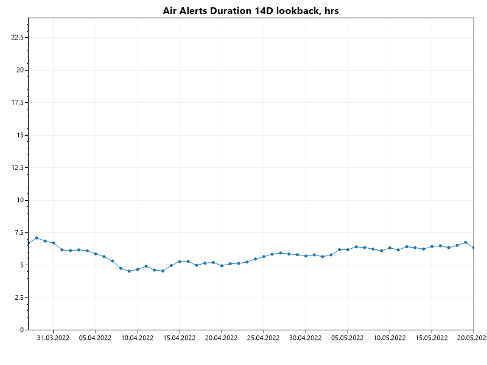
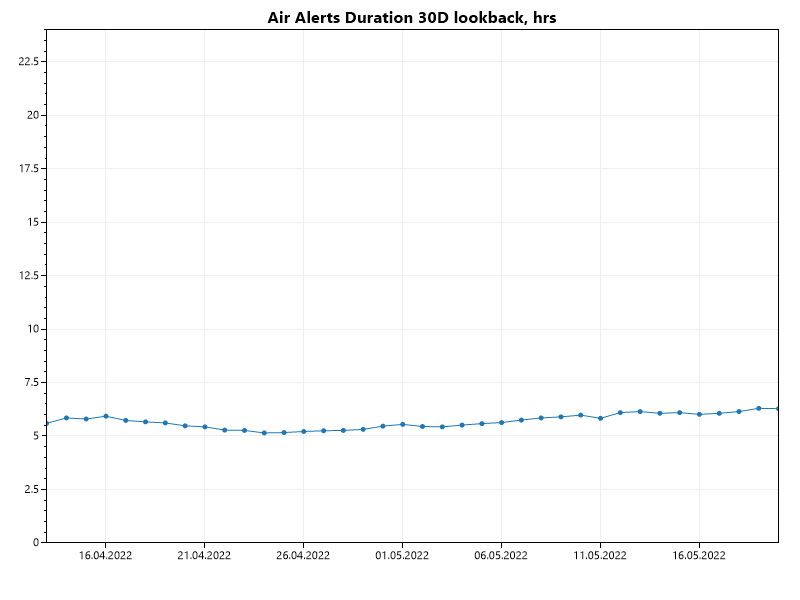

# airalerts-stats

## Purpose

The tools grabs the Telegram's [AirAlerts](https://t.me/air_alert_ua) channel data for **Kharkiv** region and plots daily and lookback average stats using ScottPlot.

## Results

May 19th, 2022

## Requirements

1. .NET 6.
2. Registered Telegram application for `api_key` and `api_hash`.
